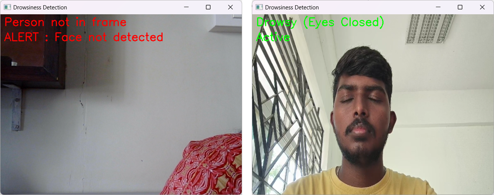

# Drowsiness Detection System


## Table of Contents
- [Drowsiness Detection System](#drowsiness-detection-system)
  - [Table of Contents](#table-of-contents)
  - [Introduction](#introduction)
  - [Features](#features)
  - [Architecture](#architecture)
    - [Convolutional Neural Network (CNN) Model](#convolutional-neural-network-cnn-model)
    - [Layer-by-Layer Feature Modeling](#layer-by-layer-feature-modeling)
  - [Performance Metrics](#performance-metrics)
    - [Accuracy and Loss](#accuracy-and-loss)
    - [Precision, Recall, and F1-Score](#precision-recall-and-f1-score)
    - [Confusion Matrix](#confusion-matrix)
    - [AUC-ROC Curve](#auc-roc-curve)
  - [Installation](#installation)
    - [Prerequisites](#prerequisites)
    - [Installation Steps](#installation-steps)
  - [Usage](#usage)
    - [Image-Based Detection](#image-based-detection)
    - [Real-Time Video Detection](#real-time-video-detection)
  - [Demo](#demo)
    - [Video Demonstration](#video-demonstration)
    - [Sample Images](#sample-images)

## Introduction

The **Drowsiness Detection System** is an intelligent application designed to monitor and detect drowsiness in individuals using both static images and real-time video feeds. Leveraging a Convolutional Neural Network (CNN), the system accurately classifies eye states as "Open Eyes" or "Closed Eyes," serving as a reliable indicator of drowsiness. This project aims to enhance safety in various scenarios such as driving, operating heavy machinery, or any activity requiring sustained attention.

## Features

- **Dual Detection Modes**: 
  - **Image-Based Detection**: Upload and analyze static images to determine eye status.
  - **Real-Time Video Detection**: Monitor live video feeds for continuous drowsiness assessment.
  
- **User-Friendly Interface**: Separate and intuitive user interfaces for image uploads and real-time video monitoring.

- **Performance Visualization**: Comprehensive performance metrics including accuracy, precision, recall, F1-score, and confusion matrices.

- **Alert Mechanism**: Real-time alerts with beep sounds when drowsiness is detected, ensuring timely intervention.

- **Model Architecture Diagram**: Visual representation of the CNN model for easy understanding and further development.

## Architecture

### Convolutional Neural Network (CNN) Model

The core of the Drowsiness Detection System is a CNN model structured to effectively capture and learn features from eye images. Below is a detailed breakdown of the model architecture:


| Layer                 | Parameters Calculated                                  |
|-----------------------|--------------------------------------------------------|
| **Conv2D Layer 1**    | (3 * 3 * 3 * 32) + 32 = 896         |
| **MaxPooling2D Layer 1** | No parameters                                     |
| **Conv2D Layer 2**    | (3 * 3 * 32 * 64) + 64 = 18,496     |
| **MaxPooling2D Layer 2** | No parameters                                     |
| **Conv2D Layer 3**    | (3 * 3 * 64 * 128) + 128 = 73,856   |
| **MaxPooling2D Layer 3** | No parameters                                     |
| **Flatten Layer**     | No parameters                                         |
| **Dense Layer 1**     | 4608 * 128 + 128 = 589,952                    |
| **Dropout Layer**     | No parameters                                         |
| **Output Dense Layer**| 128 * 1 + 1 = 129                             |

### Layer-by-Layer Feature Modeling

The CNN model begins with an input layer that accepts 64x64 RGB images. The first convolutional layer applies 32 filters of size 3x3 to detect basic features such as edges and textures, followed by a max-pooling layer that reduces spatial dimensions. The second convolutional layer increases the filter count to 64, capturing more complex patterns, and is again paired with max-pooling. The third convolutional layer further enhances feature detection with 128 filters, followed by a final max-pooling layer. The flattened layer transforms the 3D feature maps into a 1D vector, which is then processed by a dense layer with 128 neurons and a dropout layer to prevent overfitting. The output layer uses a sigmoid activation function to classify the input as either "Open Eyes" or "Closed Eyes."

## Performance Metrics

The model's performance was evaluated using various metrics to ensure its reliability and accuracy in both training and real-time applications.

### Accuracy and Loss


*Figure 1: Training and Validation Accuracy over Epochs*


*Figure 2: Training and Validation Loss over Epochs*

### Precision, Recall, and F1-Score


*Figure 3: Precision, Recall and F1 score over Epochs*

### Confusion Matrix


*Figure 5: Confusion Matrix Heatmap*


*Figure 6: Confusion Matrix Heatmap*

### AUC-ROC Curve


*Figure 7: ROC-AUC Curve*

## Installation

### Prerequisites

- Python 3.6 or higher
- TensorFlow 2.x
- Keras
- OpenCV
- NumPy
- Matplotlib
- Seaborn
- scikit-learn
- pydot and graphviz for model visualization

### Installation Steps

1. **Clone the Repository**

   ```bash
   git clone https://github.com/yourusername/drowsiness-detection-system.git
   cd drowsiness-detection-system

   ```
2. **Create a Virtual Environment**
   
   ```bash
   python -m venv venv source venv/bin/activate  # On Windows: venv\Scripts\activate
   ```

3. **Install Graphviz**
   - ### Windows: 
    Download and install from Graphviz Download. Add Graphviz to your system PATH.

   - ### macOS:

   ```bash
   brew install graphviz
   ```

   - ### Linux:

   ```bash
   sudo apt-get install graphviz
   ```

## Usage
### Image-Based Detection

1. **Run the Image Detection UI :**
    Navigate to the image_detection directory and run the application.

2. **Upload an Image :**
   Use the web interface to upload an eye image.
The system will display the prediction result as "Active (Eyes Open)" or "Drowsy (Eyes Closed)" along with the uploaded image.

### Real-Time Video Detection

1. **Run the Video Detection UI :** Navigate to the video_detection directory and run the application.

```bash
python app_video.py
```

2. **Monitor Live Video Feed**

- The application will access your webcam and start monitoring for drowsiness.
- If closed eyes are detected for a consecutive number of frames, an alert beep will sound, and a warning message will be displayed.


## Demo
### Video Demonstration

Watch the Demo Video showcasing both image-based and real-time video detection functionalities.

### Sample Images



*Figure 8: Demo Images*

